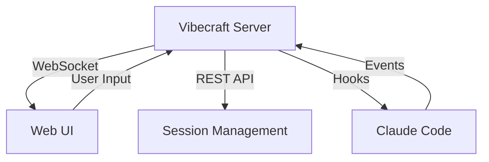
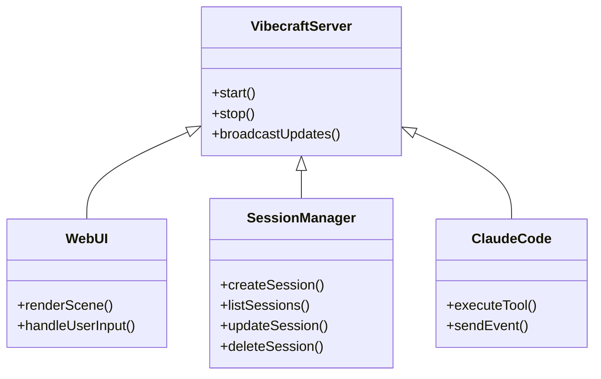

# Vibecraft 架构图

```mermaid
graph TD;
    A[Vibecraft Server] -->|WebSocket| B[Web UI];
    A -->|REST API| C[Session Management];
    A -->|Hooks| D[Claude Code];
    D -->|Events| A;
    B -->|User Input| A;
```

## 功能模块

```mermaid
classDiagram
    class VibecraftServer {
        +start()
        +stop()
        +broadcastUpdates()
    }
    
    class WebUI {
        +renderScene()
        +handleUserInput()
    }
    
    class SessionManager {
        +createSession()
        +listSessions()
        +updateSession()
        +deleteSession()
    }
    
    class ClaudeCode {
        +executeTool()
        +sendEvent()
    }
    
    VibecraftServer <|-- WebUI
    VibecraftServer <|-- SessionManager
    VibecraftServer <|-- ClaudeCode
```