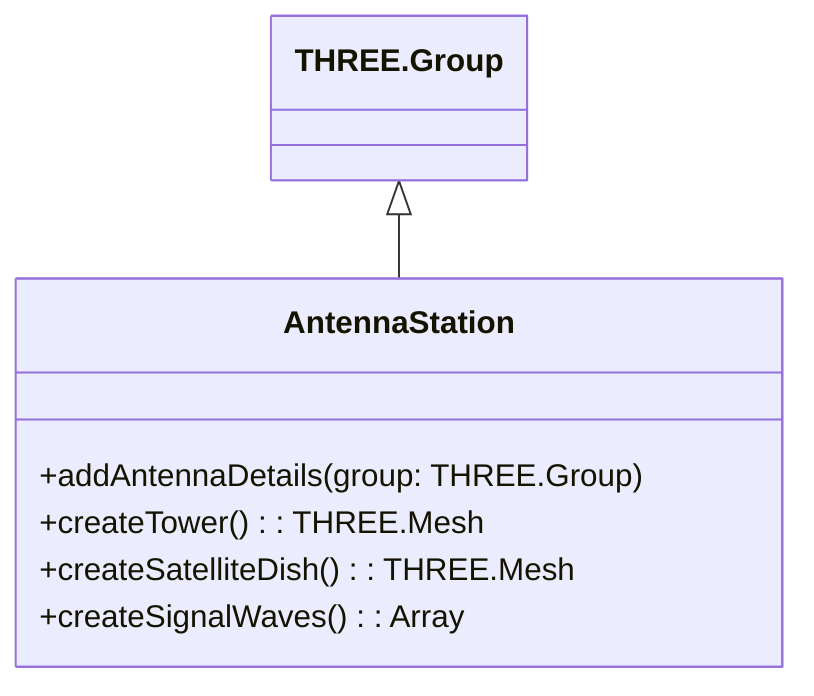
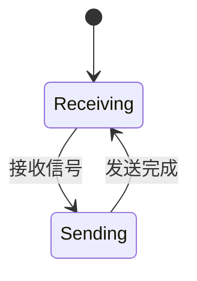

# AntennaStation UML

## 类图

```mermaid
classDiagram
    class AntennaStation {
        +addAntennaDetails(group: THREE.Group)
        +createTower(): THREE.Mesh
        +createSatelliteDish(): THREE.Mesh
        +createSignalWaves(): Array<THREE.Mesh>
    }
    
    THREE.Group <|-- AntennaStation
```

## 状态图

```mermaid
stateDiagram-v2
    [*] --> Receiving
    Receiving --> Sending: 接收信号
    Sending --> Receiving: 发送完成
```