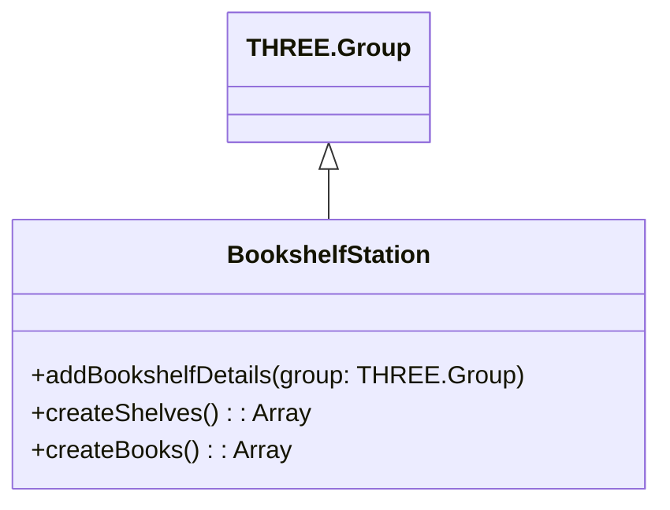
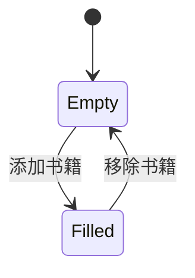

# BookshelfStation UML

## 类图

```mermaid
classDiagram
    class BookshelfStation {
        +addBookshelfDetails(group: THREE.Group)
        +createShelves(): Array<THREE.Mesh>
        +createBooks(): Array<THREE.Mesh>
    }
    
    THREE.Group <|-- BookshelfStation
```

## 状态图

```mermaid
stateDiagram-v2
    [*] --> Empty
    Empty --> Filled: 添加书籍
    Filled --> Empty: 移除书籍
```