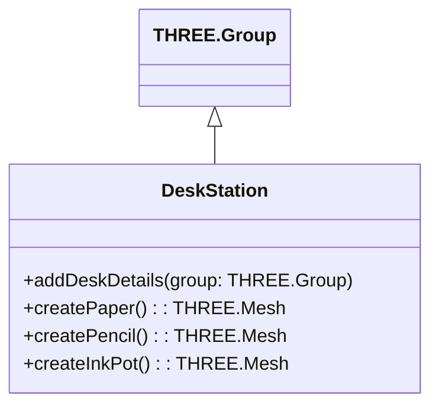
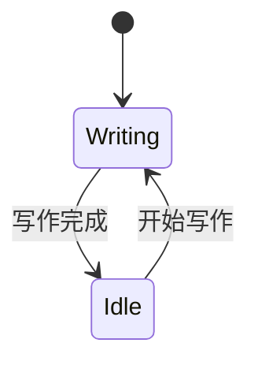

# DeskStation UML

## 类图

```mermaid
classDiagram
    class DeskStation {
        +addDeskDetails(group: THREE.Group)
        +createPaper(): THREE.Mesh
        +createPencil(): THREE.Mesh
        +createInkPot(): THREE.Mesh
    }
    
    THREE.Group <|-- DeskStation
```

## 状态图

```mermaid
stateDiagram-v2
    [*] --> Writing
    Writing --> Idle: 写作完成
    Idle --> Writing: 开始写作
```