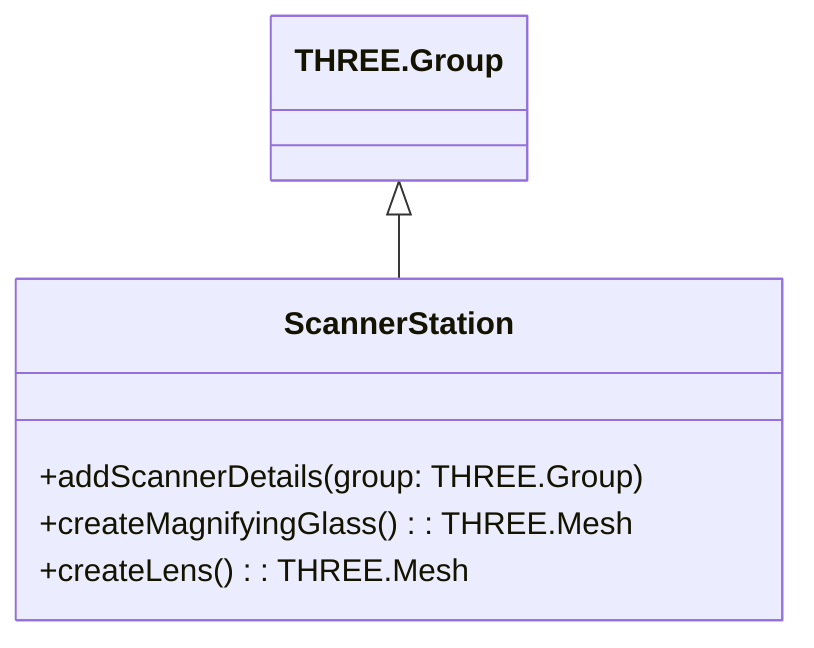
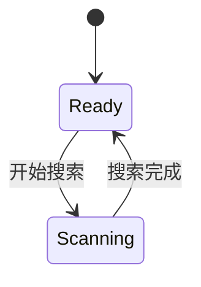

# ScannerStation UML

## 类图

```mermaid
classDiagram
    class ScannerStation {
        +addScannerDetails(group: THREE.Group)
        +createMagnifyingGlass(): THREE.Mesh
        +createLens(): THREE.Mesh
    }
    
    THREE.Group <|-- ScannerStation
```

## 状态图

```mermaid
stateDiagram-v2
    [*] --> Ready
    Ready --> Scanning: 开始搜索
    Scanning --> Ready: 搜索完成
```