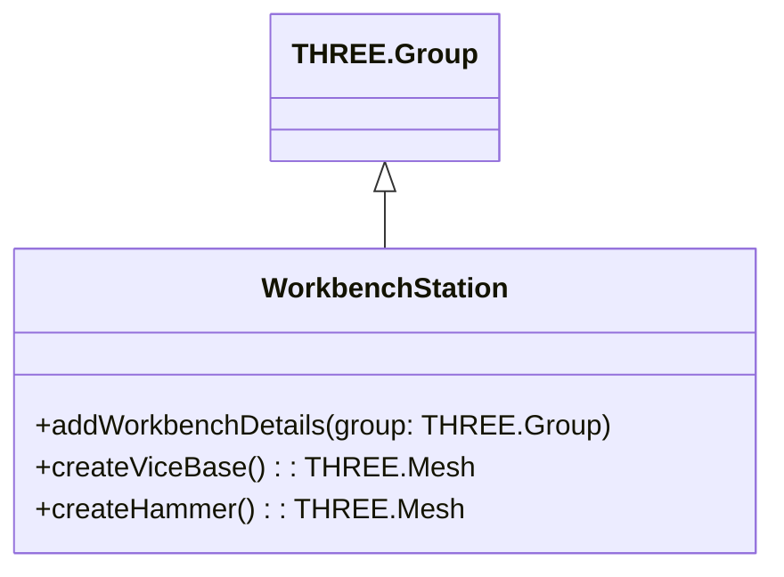
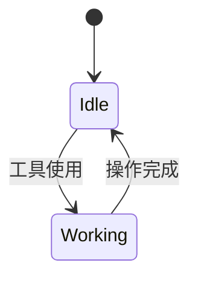

# WorkbenchStation UML

## 类图

```mermaid
classDiagram
    class WorkbenchStation {
        +addWorkbenchDetails(group: THREE.Group)
        +createViceBase(): THREE.Mesh
        +createHammer(): THREE.Mesh
    }
    
    THREE.Group <|-- WorkbenchStation
```

## 状态图

```mermaid
stateDiagram-v2
    [*] --> Idle
    Idle --> Working: 工具使用
    Working --> Idle: 操作完成
```